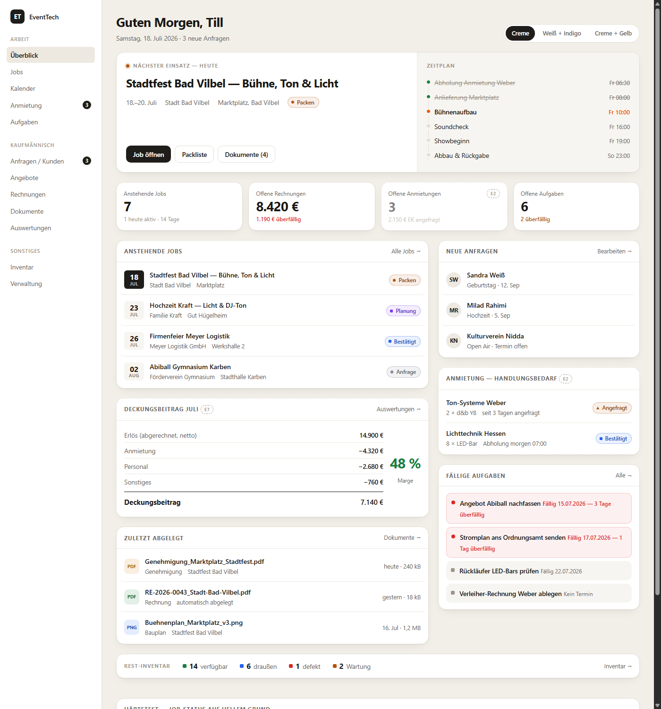
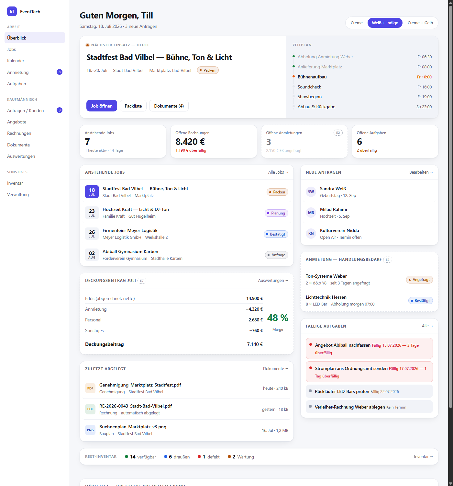
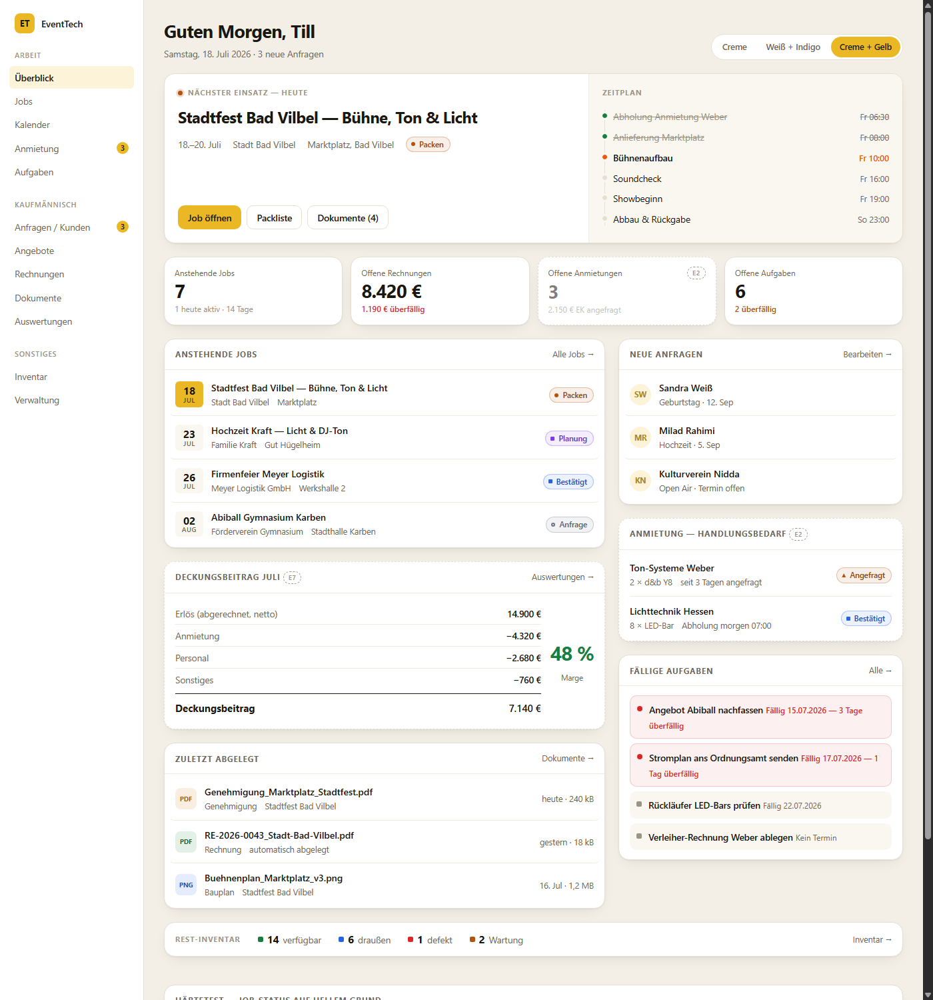

# Vision — Dashboard hell & Neuschnitt

> **Für parallele Sessions:** läuft neben der strukturellen Änderung, an der Till gerade
> in einer anderen Session arbeitet. Reiner Design-Vorschlag, **noch nicht entschieden,
> noch nicht gebaut** — keine Datei unter `apps/web/` wurde angefasst. Wenn du (Claude, in
> der anderen Session) das hier liest: kein Code-Konflikt zu erwarten, aber `DashboardPage.tsx`
> könnte sich bald grundlegend ändern — bei parallelen Änderungen daran kurz Rücksprache halten.

## Warum

`apps/web/CLAUDE.md` hielt Light-Mode bisher als „bewusst verworfen" fest. Till hat das jetzt
in Frage gestellt und vier Referenzbilder mitgebracht (warmes Creme, weiße Karten, große
Radien, Schwarz statt Bunt als Primäraktion). Gleichzeitig ist das aktuelle Dashboard noch
bestandszentriert (Geräte-Ring, Gerätestatus-Balken), obwohl sich das Geschäft laut
`PLAN-NEUAUSRICHTUNG.md` vom Verleih zum Event-Dienstleister gedreht hat. Deshalb: nicht nur
umfärben, sondern den Inhalt neu schneiden — das nimmt Etappe **E8** vorweg.

## Die drei Farbwelten

Interaktives Mockup: [`dashboard-hell.html`](./dashboard-hell.html) (Umschalter oben rechts,
`?palette=a|b|c` für Direktlinks). Screenshots als Referenz, falls kein Browser zur Hand ist:

**A — Warmes Creme, Schwarz als Akzent** (Referenzbilder 1+2, ruhigste Variante)

**B — Kühles Weiß, Indigo-Akzent** (kleinster Bruch zum heutigen Dark-Theme, Status-/Job-Farben
passen unverändert weiter)

**C — Creme + Gelb-Akzent** (mutiger, kollidiert aber sichtbar mit den Status-Farben Amber/
Wartung und Job-Status „Packen" — bewusst so gezeigt, damit die Kollision auffällt, nicht erst
im fertigen Produkt)

Till hat sich noch **nicht** entschieden.

## Der inhaltliche Neuschnitt (unabhängig von der Farbwelt)

Leitfrage: „Was läuft heute, was fehlt mir, was kostet mich das, was bleibt hängen?"

- **Neuer Kopf:** „Nächster Einsatz" wird zur Hero-Zeile mit Zeitplan, statt einer Zeile
  unter vielen.
- **Bleibt:** Anstehende Jobs, Fällige Aufgaben, Neue Anfragen (funktionieren gut).
- **Herabgestuft:** Auslastungs-Ring + Gerätestatus-Balken → eine schmale Fußzeile
  („Rest-Inventar"), weil das Rest-Inventar seit der Neuausrichtung klein ist.
- **Neu:** Offene Rechnungen (Daten vorhanden), Zuletzt abgelegte Dokumente (Block A ist
  live, `useAllDocuments` existiert). Anmietungen mit Handlungsbedarf und Deckungsbeitrag
  sind im Mockup als **Vorschau markiert** (gestrichelter Rahmen + Etappen-Chip „E2"/„E7") —
  die Daten dafür (`subrentals`, `job_costs`) kommen erst mit Block B.

## Härtetest: Job-Status-Farben auf hellem Grund

Die acht `job-*`-Farben aus `tailwind.config.js` sind für dunklen Grund gewählt; auf Weiß
fallen mehrere unter 4,5:1 Kontrast (v. a. `anfrage` #8B92A3, `abgeschlossen` #22C55E). Das
Mockup zeigt unten eine Vergleichstabelle mit nachgeschärften Werten — das ist der eigentliche
Beweis, dass der Umbau mehr ist als Tokens tauschen.

## Was als Nächstes passiert

Noch offen: Till entscheidet zwischen A/B/C. Erst danach folgt der echte Umbau (Tokens in
`tailwind.config.js`, Job-/Status-Farben nachschärfen, Seite für Seite prüfen) als eigener
Vorgang — siehe Plan unter `~/.claude/plans/polymorphic-skipping-pony.md` (lokal, nicht im
Repo) bzw. sobald entschieden, als Eintrag in `IDEAS.md` / `PLAN-NEUAUSRICHTUNG.md`
(Etappe E8).
